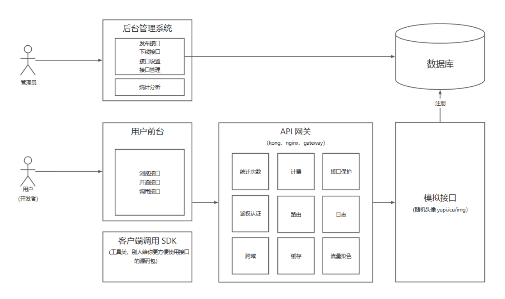
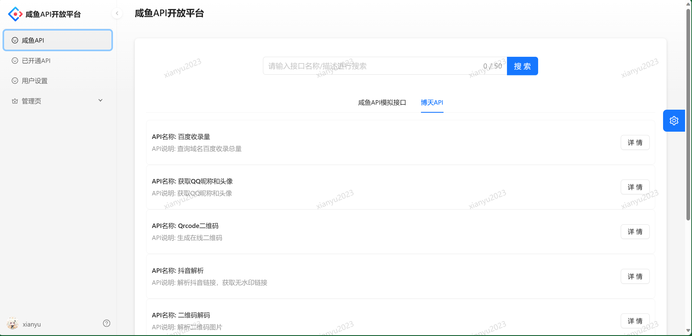
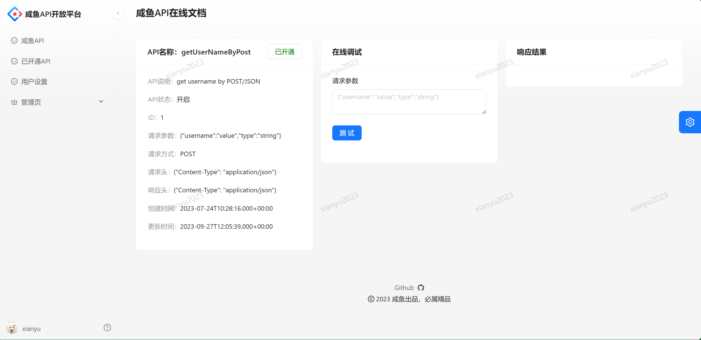
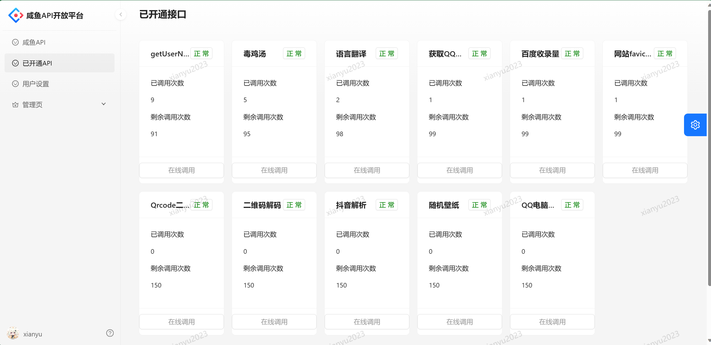
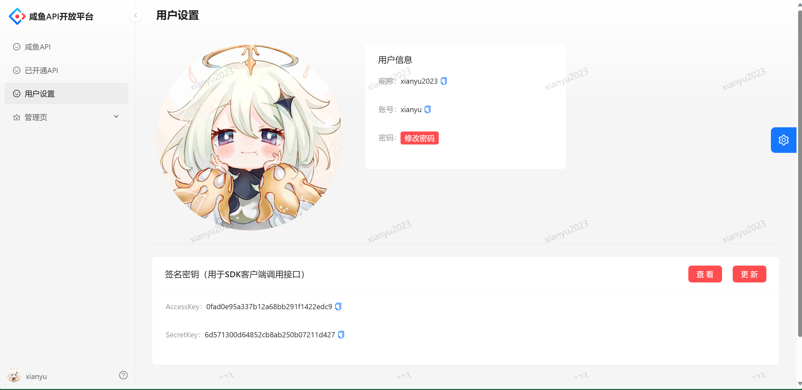
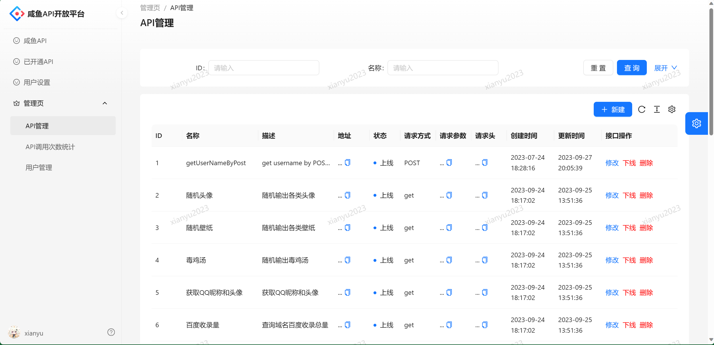
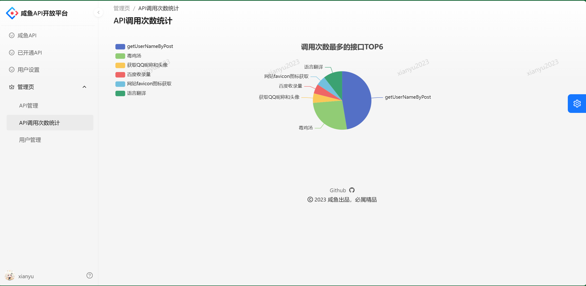
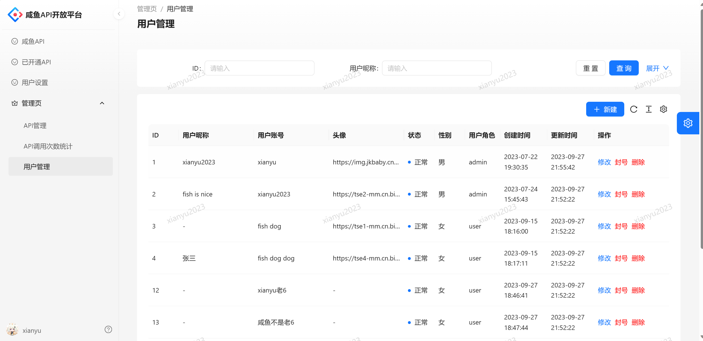
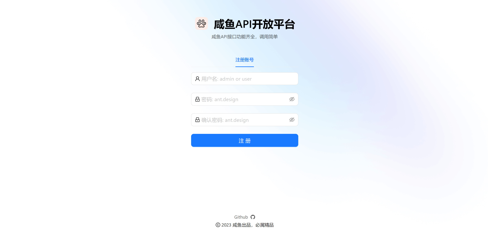

<h1 align="center">咸鱼API开放平台</h1>
<p align="center"><strong>一个提供API接口供开发者调用的平台 </strong></p>

## 项目介绍


**用户可以注册登录，浏览咸鱼API列表，可以开通接口获取一定的调用次数，能够查看已开通的接口以及剩余调用次数。支持接口在线调试，支持接口聚合搜索。**

**提供了[客户端SDK: XianYuOpenApi-client-sdk-user](https://github.com/xianyu2023/XianYuOpenApi-client-sdk-user)供开发者使用，并支持starter依赖引入，能够让开发者轻松地在项目中调用接口。用户设置页可获取签名密钥用于客户端SDK调用接口**

**管理员可以管理平台的所有接口以及用户，支持接口上线、下线、统计分析等功能，可视化接口TOP N的调用情况。**


## 网站导航

- [**咸鱼API开放平台 后端**](https://github.com/xianyu2023/xianYuApi_backend)
- [**咸鱼API开放平台 前端**️](https://github.com/xianyu2023/xianYuApi_front)

-  **[XianYuOpenApi-client-sdk-user](https://github.com/xianyu2023/XianYuOpenApi-client-sdk-user)** 🛠


## 项目模块


| 目录                                                                                                                                                  | 描述        |
|-----------------------------------------------------------------------------------------------------------------------------------------------------|-----------|
| **[xianYuApi_backend](https://github.com/xianyu2023/xianYuApi_backend)**                                                                                                                           | 平台后端服务模块  |
| **[xianyu-common](https://github.com/xianyu2023/xianYuApi_backend/tree/master/xianyu-common)**                                                                                                                               | 公共服务模块    |
| **[xianyu-gateway](https://github.com/xianyu2023/xianYuApi_backend/tree/master/xianyu-gateway)**                                                                                                                              | 网关模块      |
| **[Open_Api](https://github.com/xianyu2023/xianYuApi_backend/tree/master/Open_Api)**                                                                                                                                    | 模拟接口模块    |
| **[XianYuOpenApi-client-sdk-user](https://github.com/xianyu2023/XianYuOpenApi-client-sdk-user)**                                                                          | 开发者用SDK   |
| **[XianYuOpenApi-client-sdk-admin](https://github.com/xianyu2023/XianYuOpenApi-client-sdk-admin)**                                                                                                            | 仅平台内部用SDK |

## 项目流程


## 快速启动

### 前端

环境要求：Node.js = 18.16

安装依赖：

```
yarn or  npm install
```

启动：

```
yarn run dev or npm run start:dev
```

部署：

```
yarn build or npm run build
```

### 后端

执行sql目录下ddl.sql创建库表

## 项目选型

### **后端**

- Spring Boot 2.7.0
- Spring MVC
- MySQL 数据库
- Dubbo 分布式（RPC、Nacos）
- Spring Cloud Gateway 微服务网关
- API 签名认证（Http 调用）
- Swagger + Knife4j 接口文档
- Spring Boot Starter（SDK 开发）
- Spring Data Redis 分布式登录
- 聚合搜索服务（包含门面模式、适配器模式、注册器模式等设计模式）
- Jsoup数据抓取
- ElasticSearch搜索引擎
- 数据同步（Logstash、Canal）
- Apache Commons Lang3 工具类
- MyBatis-Plus 及 MyBatis X 自动生成
- Hutool、Apache Common Utils、Gson 等工具库

### 前端

- React 18

- Ant Design Pro 5.x 脚手架

- Ant Design & Procomponents 组件库

- Umi 4 前端框架
  
- Umi Request请求工具 (Axios 的封装) 

- OpenAPI 前端代码生成


## 前端展示

### 首页



### 接口详情


### 已开通接口页


### 用户设置页


### 管理页

#### API管理


#### API调用次数统计


#### 用户管理


### 登录/注册



